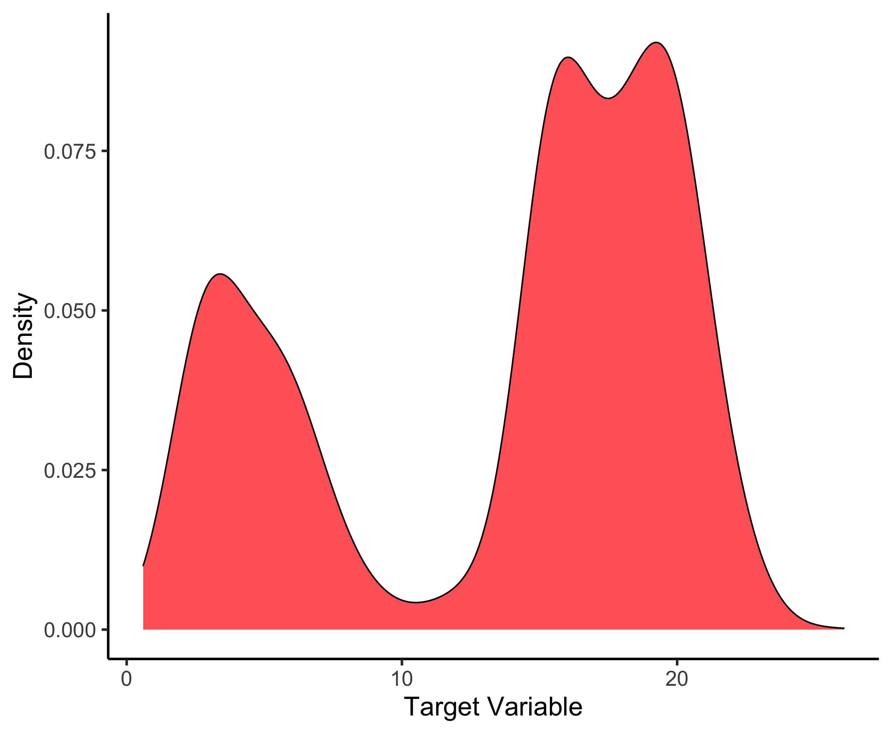
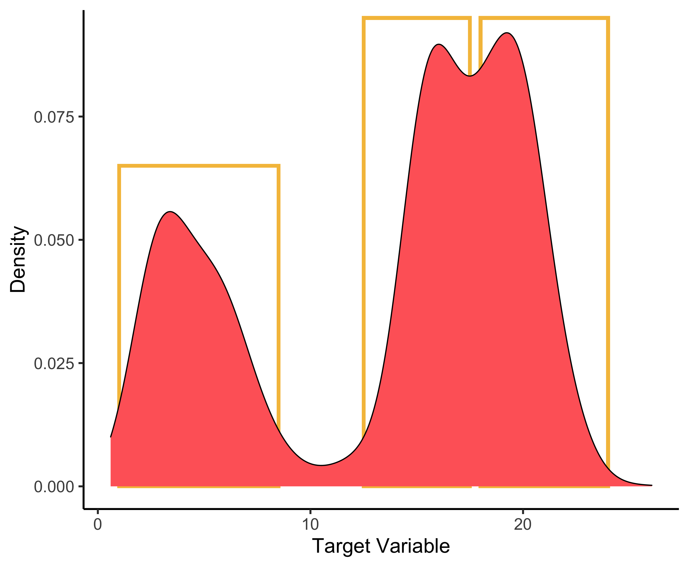
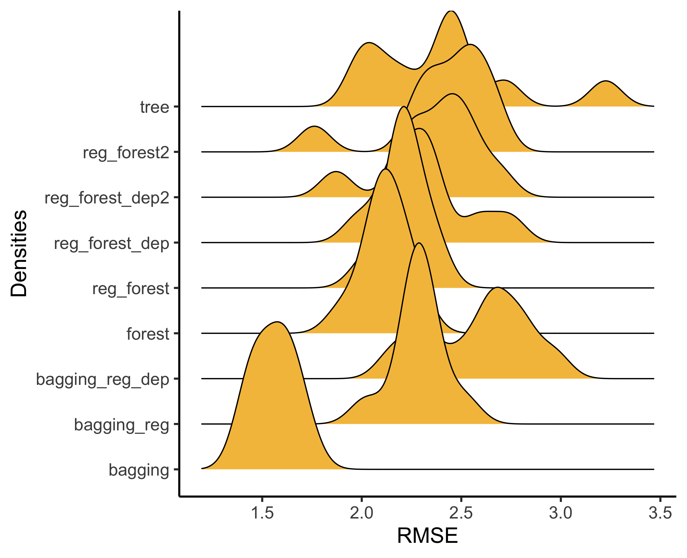

class: middle, center


```{r inf, include = FALSE, cache = FALSE, eval = TRUE}
options(htmltools.dir.version = FALSE)
knitr::opts_chunk$set(warning = FALSE, message = FALSE, 
  comment = NA, dpi = 300, echo = FALSE, 
  fig.width = 5, fig.size = 5, eval = TRUE, 
  fig.align = "center", out.width = "60%", cache = TRUE)
library(tidyverse)

library(RefManageR)
bibs <- ReadBib("refs.bib", check = FALSE)

```


.pull-left[

# **The `tidyverse` for Machine Learning**

### Bruna Wundervald <br> Maynooth University

#### R-Ladies Helsinki Meetup, June 2020


]

.pull-right[

<div class="row">

<div class="column">

</div>

<div class="column">

</div>

<div class="column">

  </div>
  
<div class="column">

  </div>  
  
<div class="column">

  </div>  
</div>
]

---
class: inverse, middle


.pull-left[


  - Ph.D. Candidate in Statistics at the 
  [Hamilton Institute, Maynooth University](https://www.maynoothuniversity.ie/hamilton)
  
  - Especially interested in tree-based models:
    - Regularization for tree-based models
    - Bayesian Additive Regression Trees (BART)

]

.pull-right[

# Find me

[GitHub: @brunaw](http://github.com/brunaw)  
[Site: http://brunaw.com/](http://brunaw.com/)  
[Twitter: @bwundervald](http://twitter.com/bwundervald)  

]


---
class: middle


# Summary

- Tree-based models
- Gain penalization for tree regularization
- The data
- Modelling:
  - Train and test splits
  - Creating a model list
  - Building a modelling function
  - Training all models 
  - Evaluating the models
  
#### Find this talk at: http://brunaw.com/slides/rladies-helsinki/talk.html

#### GitHub: https://github.com/brunaw/tidyverse-for-ml

---


# Motivation

Using the `tidyverse` for Machine Learning gives us:

- All tools needed 
- Clear & consistent syntax
- Reproducibility advantages: all elements of our models 
in only one object 
  - Train and test sets, tuning parameters, models used, 
  evaluation metrics, etc

# Basic ML Steps

  - Train and test separation
  - Model definition
  - Model evaluation

---
class: inverse, middle

# Tree-based models

---
# Tree-based models

.pull-left[
```{r, out.height="30%", out.width="80%", fig.height=4.5, echo = FALSE}
knitr::include_graphics("img/trees.png")
```
]


.pull-right[
Suppose we have a response variable $Y$ (continuous or class), and
a set of predictor variables $\mathbf{X}$. 

- Trees stratify the predictors'space into regions 
- Uses binary splitting rules to find the regions

```{r, out.height="30%", out.width="80%", fig.height=5, echo = FALSE}
knitr::include_graphics("img/vars_space2.png")
```


]


---

# Trees: the algorithm

Recursive binary splitting: 


  1. Select the predictor $X_j$ and the cutpoint $s$ such that 
the split $\{X | X_j <  s\}$ and $\{X | X_j \geq  s\}$ leads to
the greatest reduction in the variance of $Y$. 
    - All predictors and all available cutpoints are tested
  
  2. For each region found, predict either the mean of $Y$ in the region
(continuous case) or the most common class (classification case). 

  3. Continue until some criterion is reached
    - Example: continue until no region contains more than 5 observations
    

---

# Gain penalization for tree regularization

- Firstly presented in `r Citet(bibs[key = "guided"])`:
  - The authors **penalise the gain (RSS reduction)** of each 
  variable, for each tree when building a model

- The main idea is to weigh the gain of each variable, with

$$\begin{equation} Gain_{R}(X_i, v) =  \begin{cases} \lambda_i Gain(X_i, v), i \notin F \text{ and} \\ Gain(X_i, v), i \in F,  \end{cases} \end{equation}$$


where $F$ represents the set of indices used in the previous nodes and 
$\lambda_i \in (0, 1]$ is the penalization applied to the splitting. 


- The variables will only get picked if their gain is **very** high. 


More details:  *Wundervald, B, A. Parnell, and K. Domijan (2020). “Generalizing Gain Penalization for Feature Selection in Tree-based Models”. In: arXiv e-prints, p. arXiv:2006.07515. arXiv: 2006.07515*

---
### Modelling: tree-based methods

  - Trees (CART): 1 tree, $\texttt{mtry}$ = # all available variables
  
  - *Bagging*: average of many trees, $\texttt{mtry}$ = # all available variables
  
  - Regularized *Bagging*: same as above, but with a
  variable gain penalized by a factor between 0 and 1 
  
  - Regularized *Bagging*, with depth penalization: 
  same as above, but with an "extra" penalization when a new variable
 is to be picked in a deep node of a tree:
 
$$\begin{equation} Gain_{R}(\mathbf{X}_{i}, t, \mathbb{T}) =  \begin{cases} \lambda_{i}^{d_{\mathbb{T}}} \Delta(i, t), \thinspace i \notin F \text{ and} \\ \Delta(i, t), \thinspace i \in  F, \end{cases} \end{equation}$$

where $d_{\mathbb{T}}$ is the current depth of the $\mathbb{T}$ tree, 
$\mathbb{T} = (1, \dots, \texttt{ntree})$, for the $i$-th feature.
  
  

  - Random Forest: average of many trees, $\texttt{mtry} \approx \sqrt{\text{# all available variables}}$
  
- Regularized Random Forests: average of many trees, $\texttt{mtry} \approx \text{# all available variables}/2$, 
  variable gain penalized by a factor between 0 and 1

- Regularized Random Forests with depth penalization: same 
 as above, but with an "extra" penalization when a new variable
 is to be picked in a deep node of a tree
 

---
# The data

- Target variable (**ridership**): daily number of people entering the Clark and Lake train station in Chicago (in thousands)


> Goal: to predict this variable and find the optimal variables
for that

- 50 Predictors:
  - Current date  
  - The 14-day lagged ridership at this and other stations (units: thousands of rides/day)
  - Weather information
  - Sport teams schedules
  - +


---
class: middle

# Loading data and visualizing

.pull-left[


```{r
library(tidyverse)
library(tidymodels)
library(ranger) # for tree-based models

data <- dials::Chicago

data %>%  
  ggplot(aes(x = ridership)) +
  geom_density(fill = "#ff6767", alpha = 1) +
  labs(x = "Target Variable", y = "Density") +
  theme_classic(18) 
```

```{r, echo = FALSE}
library(tidyverse)
library(tidymodels)
library(ranger)

data <- dials::Chicago
```


]

.pull-right[

```{r, eval = TRUE, echo = FALSE}

```
]

---
class: middle


- Interesting distribution!
- Good for tree-based models

```{r, eval = TRUE, echo = FALSE}

```

---
class: inverse, middle

# Modelling


---

# Step 1. Train (75%) and test (25%) splits


```{r
data_tibble <- rep(list(data), 10) %>% 
  enframe(name = 'index', value = 'data') %>% 
  mutate(train_test = purrr::map(data, initial_split, prop = 3/4))
```

```{r, echo = FALSE}
data_tibble <- rep(list(data), 10) %>% 
  enframe(name = 'index', value = 'data') %>% 
  mutate(train_test = purrr::map(data, initial_split, prop = 3/4))

print(data_tibble, n = 3)
```


- The `train_test` column is a list with two elements: the train and test sets


---

# Step 2. Creating our model list 


```{r
models <- list(
 tree = list(mtry = ncol(data) - 1, trees = 1, reg.factor = 1, depth = FALSE),
 
 bagging = list(mtry = ncol(data) - 1, trees = 100, reg.factor = 1, depth = FALSE), 
 
 bagging_reg = list(mtry = ncol(data) - 1, trees = 100, reg.factor = 0.7, depth = FALSE),
 
 bagging_reg_dep = list(mtry = ncol(data) - 1, trees = 100, reg.factor = 0.7, depth = TRUE), 
 
 forest = list(mtry = sqrt(ncol(data) - 1), trees = 100, reg.factor = 1, depth = FALSE),
 
 reg_forest =  list(mtry = (ncol(data) - 1)/2, trees = 100, reg.factor = 0.7, depth = FALSE),
 
 reg_forest_dep =  list(mtry = (ncol(data) - 1)/2, trees = 100, reg.factor = 0.7, depth = TRUE),
 
 reg_forest2 =  list(mtry = (ncol(data) - 1)/2, trees = 100, reg.factor = 0.2, depth = FALSE), 
 
 reg_forest_dep2 = list(mtry = (ncol(data)-1)/2, trees = 100, reg.factor = 0.2, depth = TRUE)) %>% 
 enframe(name = 'model', value = 'parameters')
```

```{r, echo = FALSE}
models <- list(
  tree = list(mtry = ncol(data) - 1, trees = 1, reg.factor = 1, 
              depth = FALSE),
  bagging = list(mtry = ncol(data) - 1, trees = 100, reg.factor = 1, depth = FALSE), 
  bagging_reg = list(mtry = ncol(data) - 1, trees = 100, reg.factor = 0.7, depth = FALSE),
bagging_reg_dep = list(mtry = ncol(data) - 1, trees = 100, reg.factor = 0.7, depth = TRUE), 
  forest = list(mtry = sqrt(ncol(data) - 1), trees = 100, reg.factor = 1, depth = FALSE),
  reg_forest =  list(mtry = (ncol(data) - 1)/2, trees = 100, reg.factor = 0.7, depth = FALSE),
  reg_forest_dep =  list(mtry = (ncol(data) - 1)/2, trees = 100, reg.factor = 0.7, depth = TRUE),
  reg_forest2 =  list(mtry = (ncol(data) - 1)/2, trees = 100, reg.factor = 0.2, depth = FALSE), 
  reg_forest_dep2 =  list(mtry = (ncol(data) - 1)/2, trees = 100, reg.factor = 0.2, depth = TRUE)) %>% 
  enframe(name = 'model', value = 'parameters')
```


---

class: middle

Adding the models to our main `tibble`:

```{r
data_tibble <- data_tibble %>% 
*  crossing(models) %>% 
   arrange(model)
```


# What do we have so far?

A tibble with:
  - All the train and test data
  - Their combinations with the all the model configurations

```{r, echo = FALSE}
data_tibble <- data_tibble %>% 
  crossing(models) %>% 
  arrange(model)
print(data_tibble, n = 3)
```

---

# Step 3. Building a modelling function 

  - We will use the `ranger` package through the `parsnip` interface
  - There are main arguments and package-specific arguments to be
  set
  
```{r
modelling <- function(train, mtry = NULL, trees = NULL, 
                      reg.factor = 1, depth = FALSE, 
                      formula = ridership ~ ., mode = "regression") {
  
  model_setup <- parsnip::rand_forest(mode = mode, mtry = mtry, trees = trees) %>% 
    parsnip::set_engine("ranger", regularization.factor = reg.factor, 
                                  regularization.usedepth = depth)

  us_hol <- timeDate::listHolidays() %>% str_subset("(^US)|(Easter)")
  # Recipe 
  rec <- recipe(formula, data = train) %>% 
    step_holiday(date, holidays = us_hol) %>%  # Include US holidays
    step_date(date) %>% step_rm(date) 
  # Preparation
  preps <- prep(rec, verbose = FALSE)
  # Final fit!   
  fit <- model_setup %>% parsnip::fit(formula, data = juice(preps))
  return(fit)
}
```

```{r, echo = FALSE}
modelling <- function(train, mtry = NULL, trees = NULL, 
                      reg.factor = 1, depth = FALSE, 
                      formula = ridership ~ ., mode = "regression") {
  
  model_setup <-   parsnip::rand_forest(mode = mode, mtry = mtry, trees = trees) %>% 
    parsnip::set_engine("ranger", regularization.factor = reg.factor, 
                        regularization.usedepth = depth)
  
  us_hol <- timeDate::listHolidays() %>% str_subset("(^US)|(Easter)")
  # Recipe 
  rec <- recipe(formula, data = train) %>% 
    step_holiday(date, holidays = us_hol) %>%  # Include US holidays
    step_date(date) %>% 
    step_rm(date) 

  # Preparation
  preps <- prep(rec, verbose = FALSE)

  # Final fit!   
  fit <- model_setup %>% parsnip::fit(formula, data = juice(preps))

  return(fit)
}
```


---

# Step 3. Building a modelling function 

## How do our model configuration looks like?

```
  #  Random Forest Model Specification (regression)
  #  
  #  Main Arguments:
  #   mtry = mtry
  #   trees = trees
  #  
  #  Engine-Specific Arguments:
  #   regularization.factor = reg.factor
  #   regularization.usedepth = depth
  #  
  #  Computational engine: ranger 

```

---

# Step 4. Training all models (90) at once -- might be slow (!)

```{r

training_models <- data_tibble %>% 
  mutate(
    all_parameters = 
      map2(parameters, map(train_test, training), 
           ~list_modify(.x, train = .y)))  %>% 
  mutate(model_trained = invoke_map(modelling, all_parameters))

```

```{r, echo = FALSE}
training_models <- data_tibble %>% 
  mutate(
    all_parameters = 
      map2(parameters, map(train_test, training), 
           ~list_modify(.x, train = .y)))  %>% 
  mutate(model_trained = invoke_map(modelling, all_parameters))

```


---

# Which are the best models?


- Metrics:

  - Root Mean Squared Error
  - Total number of variables used in the model
  - R-squared
  
```{r
rmse <- function(model, test, formula = ridership ~ .,
        us_hol = timeDate::listHolidays() %>% str_subset("(^US)|(Easter)")){
  
  rec <- recipe(formula, data = test) %>% 
    step_holiday(date, holidays = us_hol) %>%  # Include US holidays
    step_date(date) %>% 
    step_rm(date) 
  
  preps <- prep(rec, verbose = FALSE)
  pp <- predict(model, juice(preps))
  sqrt(mean((pp$.pred - test$ridership)^2))
}

n_variables <- function(model){
  length(unique((unlist(model$fit$forest$split.varIDs))))
}
```
  
```{r, echo = FALSE}
rmse <- function(model, test, formula = ridership ~ ., 
                us_hol = timeDate::listHolidays() %>% str_subset("(^US)|(Easter)")){
  
  rec <- recipe(formula, data = test) %>% 
    step_holiday(date, holidays = us_hol) %>%  # Include US holidays
    step_date(date) %>% 
    step_rm(date) 
  
  preps <- prep(rec, verbose = FALSE)
  pp <- predict(model, juice(preps))
  sqrt(mean((pp$.pred - test$ridership)^2))
}

n_variables <- function(model){
  length(unique((unlist(model$fit$forest$split.varIDs))))
}
```
  
  
---

# Step 5. Evaluating models

```r
results <- training_models %>% 
  mutate(rmse = map2_dbl(.x = model_trained, .y = map(train_test, testing), rmse), 
    n_variables = map_int(model_trained, n_variables),
    rsquared = map_dbl(model_trained, ~{.x$fit$r.squared})) 
```

```{r, echo = FALSE, eval = TRUE}
results <- training_models %>% 
  mutate(
    rmse = map2_dbl(.x = model_trained,
                   .y = map(train_test, testing), 
                   ~rmse(model = .x, test = .y)), 
    n_variables = map_int(model_trained, n_variables),
    rsquared = map_dbl(model_trained, ~{.x$fit$r.squared})) 


tab <- results %>% 
  select(model, rmse, n_variables, rsquared) %>% 
  group_by(model) %>% 
  summarise_all(mean) %>% 
  arrange(model)
```


```{r, eval = TRUE, echo = FALSE}
library(formattable)
library(kableExtra)


tab %>% 
  mutate_if(is.numeric, ~round(.x, 2)) %>% 
  mutate_at(vars(2, 3), 
    ~ifelse(. == min(.), color_bar("lightgreen")(.), .)) %>% 
    mutate_at(vars(4), 
    ~ifelse(. == max(.), color_bar("lightgreen")(.), .)) %>% 
  knitr::kable(escape = FALSE, format = 'html',
               caption="Mean results per model combination") %>%
  kable_styling(bootstrap_options = c("condensed", "hover"), 
                full_width = TRUE) %>% 
  column_spec(3, width = "2cm")  %>% 
  column_spec(2, width = "2cm")  
```


---

## A closer look at the RMSE

```{r, eval = TRUE, echo = FALSE}
library(ggridges)


p <- results %>% 
  ggplot(aes(x = rmse, y = model)) +
  geom_density_ridges(scale = 4, fill = "#f5c04a") +
  labs(y = "Densities", x = "RMSE") +
  theme_classic(18) +
  theme(
    panel.background = element_rect(fill = "transparent"), # bg of the panel
    plot.background = element_rect(fill = "transparent", color = NA), # bg of the plot
    panel.grid.major = element_blank(), # get rid of major grid
    panel.grid.minor = element_blank(), # get rid of minor grid
    legend.background = element_rect(fill = "transparent"), # get rid of legend bg
    legend.box.background = element_rect(fill = "transparent") # get rid of legend panel bg
  )


ggsave(plot = p, filename = "img/results.png", 
       width = 8, height = 6.5, 
       device = png(), 
       bg = "transparent")
```

```{r, eval = TRUE}

```


---

# The final object 

```{r}
print(results, n = 5)
```

---

# Conclusions

.pull-left[
  - We can build a unique object to store everything at the same time:
  data, train, test, seeds, hyperparameters, fitted models, results, evaluation metrics, computational details, etc

  - Very useful to quickly compare models
  - Reproducibility (papers, reports)

]

.pull-right[
```{r echo = FALSE, out.width="70%"}

```
]


---


--- 
 
# References


```{r, echo = FALSE, eval = TRUE, results='asis'}
print(bibs, 
      .opts = list(check.entries = FALSE, 
                   style = "html", 
                   bib.style = "authoryear"))
```


---


class: bottom, center, inverse

<font size="30">Thanks! </font>

 

<b>

 <color="FFFFFF">  https://github.com/brunaw </color>
 
